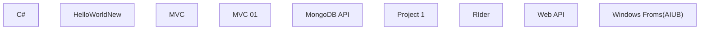

## 1. Stack
- Language: C#
- Frameworks observed via folder/file structure: ASP.NET Core MVC (`MVC/`, `MVC 01/`), ASP.NET Core Web API (`Web API/`, `MongoDB API/`), ASP.NET Core Razor Pages (`Project 1/CourseSelector/`), WinForms (`Windows Froms(AIUB)/`)
- `MongoDB API/` includes `MongoDbSettings.cs` / `ProductService.cs`, indicating MongoDB as the data store for that project
- No root-level package/build manifest (package.json, go.mod, pyproject.toml, Cargo.toml); each subfolder is an independent `.csproj`/`.sln` project
- README.md (root) frames this as a multi-topic .NET learning repository

## 2. Directory map

| Path | What lives there |
|---|---|
| `C#/` | C# fundamentals: OOP, methods, generics, interfaces, misc scripts |
| `C#/OOPS/` | Abstraction, encapsulation, constructor, this/readonly examples |
| `C#/Methods/` | Method overloading, named/positional arguments |
| `C#/Youtube/` | Tutorial-following practice folders (Part 1–5) |
| `HelloWorldNew/` | Starter project container |
| `HelloWorldNew/HelloWorldApp/` | HelloWorldApp: Program.cs, csproj, appsettings |
| `MVC/` | First ASP.NET Core MVC example container |
| `MVC/Buisness/` | Buisness MVC app: Controllers, Models, Views, Program.cs |
| `MVC 01/` | Second ASP.NET Core MVC example container |
| `MVC 01/Buisness/` | Buisness MVC app: Controllers, Models, Views, Program.cs |
| `MongoDB API/` | ASP.NET Core Web API root: Program.cs, csproj |
| `MongoDB API/Controllers/` | HealthController, ProductController |
| `MongoDB API/Services/` | ProductService (Mongo data access) |
| `MongoDB API/Models/` | MongoDbSettings, Product |
| `Project 1/` | Practice project container + docs |
| `Project 1/CourseSelector/` | Razor Pages app: Models, Pages, Services |
| `Project 1/docs/` | Static HTML docs site (css, js, images) |
| `RIder/` | JetBrains Rider example solutions |
| `RIder/Constructor/` | Constructor solution |
| `RIder/LabTask/` | LabTask solution |
| `Web API/` | RESTful Web API example container |
| `Web API/EcommerceWebAPI/` | EcommerceWebAPI: Program.cs, csproj, .http file |
| `Windows Froms(AIUB)/` | WinForms desktop app coursework |
| `Image/` | Standalone image asset (image.png) |

## 3. Diagram

Each box is an independent, standalone project folder — no observed code-level dependencies between them.

## 4. Component index
- [[C#]]
- [[HelloWorldNew]]
- [[MVC]]
- [[MVC 01]]
- [[MongoDB API]]
- [[Project 1]]
- [[RIder]]
- [[Web API]]
- [[Windows Froms(AIUB)]]

## 5. Entry points
- `HelloWorldNew/HelloWorldApp/Program.cs` — dev/prod: `dotnet run` from `HelloWorldNew/HelloWorldApp/`
- `MVC/Buisness/Program.cs` — dev/prod: `dotnet run` from `MVC/Buisness/`
- `MVC 01/Buisness/Program.cs` — dev/prod: `dotnet run` from `MVC 01/Buisness/`
- `MongoDB API/Program.cs` — dev/prod: `dotnet run` from `MongoDB API/`
- `Project 1/CourseSelector/Program.cs` — dev/prod: `dotnet run` from `Project 1/CourseSelector/`
- `Web API/EcommerceWebAPI/Program.cs` — dev/prod: `dotnet run` from `Web API/EcommerceWebAPI/`
- `Windows Froms(AIUB)/` and `RIder/*` — opened/run via IDE (Visual Studio / Rider), per their `.sln` files
- `C#/` — individual `.cs` files and small `.sln` projects, run per-file/per-project

## 6. Conventions
(Observed from directory/file naming only — no source file contents were read.)
- Each top-level folder is a self-contained project with its own `.sln`/`.csproj`
- ASP.NET Core projects (`MVC/`, `MVC 01/`, `MongoDB API/`, `Project 1/CourseSelector/`, `Web API/`) each carry a paired `appsettings.json` + `appsettings.Development.json`
- MVC-style projects split into `Controllers/`, `Models/`, `Views/`, `Properties/`, `wwwroot/`
- `MongoDB API/` splits into `Controllers/`, `Models/`, `Services/` (service-layer pattern for data access)
- `Project 1/CourseSelector/` splits into `Models/`, `Pages/`, `Services/` (Razor Pages convention)
- Solution name typo "Buisness" is consistent across both `MVC/` and `MVC 01/`

## 7. Where things go
- New C# language example → add a `.cs` file under `C#/` (or a matching subfolder like `C#/OOPS/`)
- New MVC controller/view/model → `MVC/Buisness/Controllers/`, `MVC/Buisness/Views/`, `MVC/Buisness/Models/` (or the `MVC 01/Buisness/` equivalents)
- New MongoDB-backed endpoint → controller in `MongoDB API/Controllers/`, service in `MongoDB API/Services/`, model in `MongoDB API/Models/`
- New Web API endpoint → `Web API/EcommerceWebAPI/`
- New Razor page for the course-selector app → `Project 1/CourseSelector/Pages/`
